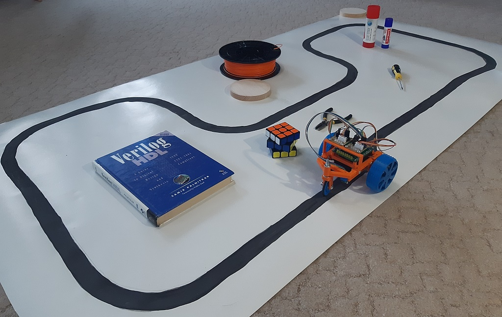

# BEAM робот

Beam-ctrl-bot - машинка едет по полосе управляемая оптическими датчиками, используются IR светодиоды и IR фото транзисторы.
Подробнее вот здесь: https://marsohod.org/projects/proekt-ma3128/453-beam-robot
Так же по ссылке есть видео демонстрация машинки движущейся по полосе.
