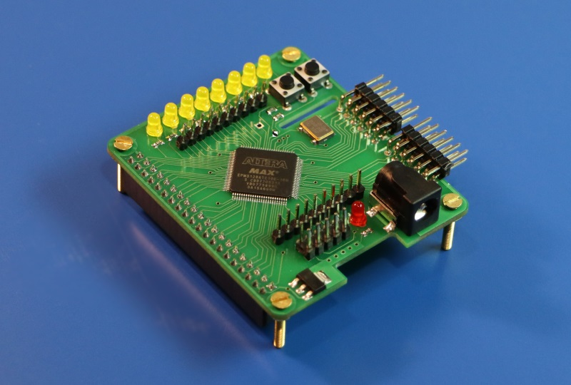

# MA3128

Altera CPLD MAX EPM3128TC100 hat board for Raspberry Pi3 / Pi4
Board helps to attach step motors 28BYJ-48 or servos like MG995 to Raspberry Pi3 or Pi4.

Простая плата с Altera MAX-3128 CPLD. Плата может использоваться, как простой контроллер для управления шаговыми двигателями машинок, игрушек.

Например, посмотрите примеры машинок марсоходов IR-ctrl-bot (машинка управляемая пультом ДУ) или Beam-ctrl-bot - машинка едет по полосе управляемая оптическими датчиками.