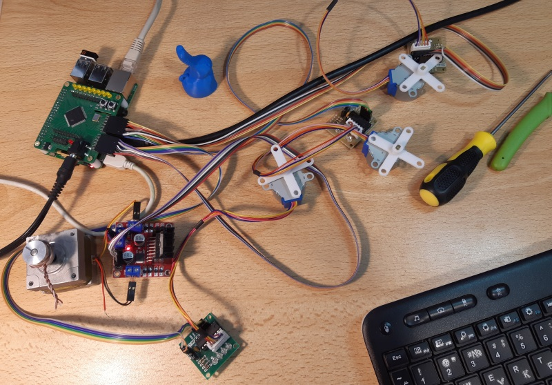

# Управление шаговыми моторчиками из Raspberry через плату MA3128

Плата с Altera MAX CPLD фактически принимает команды из последовательного порта Raspberry и исполняет команды по управлению шаговыми двигателями.
